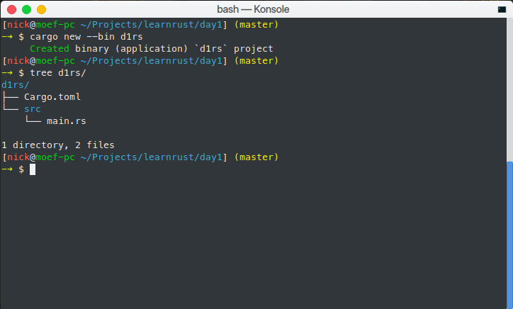
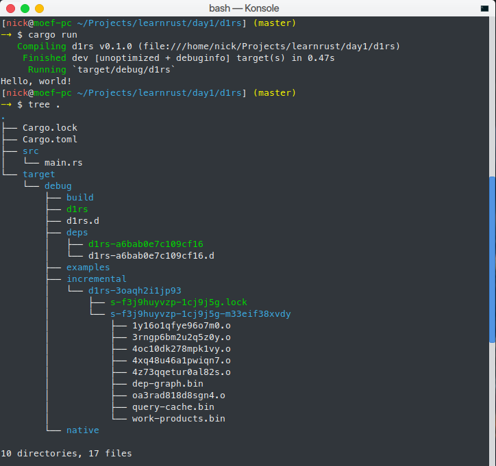

<Title: 'Hello' Cargo />

##— Mở đầu
Ngày hôm qua ([ngày 0](https://daynhauhoc.com/t/cung—hoc—rust—ngay—thu—0—hoc—hanh—gi—gio—nay/71992)), mình đã giới thiệu sơ lược về Rust, nếu bạn chưa nghe qua Rust thì có thể đọc lại. Lưu ý, các ví dụ mình sẽ viết trên Linux.
Ngày hôm nay, chúng ta sẽ học:

 — Cấu trúc một chương trình "Hello world!" trên Rust.
 — Làm quen với dòng lệnh: trình biên dịch rustc và công cụ quản lý dự án và thư viện — Cargo.

Yêu cầu:

 — Biết sử dụng dòng lệnh cơ bản: bash hoặc cmd (như setup biến môi trường, sử dụng lệnh `cd`, ... vì sẽ rất mất thời gian nếu mình phải đào tạo cách sử dụng).
 — Đã cài đặt thành công Rust (stable) 1.28 trên máy. Kiểm tra bằng cách gõ `rustc --version` vào cửa sổ dòng lệnh.

---
##— "Hello world!" bằng Rust?
Một file mã nguồn của Rust có phần mở rộng là `.rs`. Gõ lại đoạn mã sau là lưu lại với tên bất kỳ cùng với `.rs` (`helloworld.rs` chẳng hạn). Rust có hỗ trợ trên vim, Sublime Text, VS Code,... Nếu bạn muốn mình chọn dùm, mình chọn Sublime Text với package Rust Enhanced (giúp bạn kiểm tra code khi save).
Nếu bạn chưa cài đặt Rust vào máy thì bạn cũng có thể truy cập play.rust-lang.org gõ lại đoạn mã sau vào.

```rust
// Đây là comment 1 dòng
/*
   Đây là comment nhiều dòng.
 */

fn main() {
    println!("Hello world!");
}
```

Nếu bạn sử dụng Rust Playground thì chỉ cần nhấn Run thì chương trình sẽ được compile online và in dòng "Hello world!" ra màn hình. Rất đơn giản phải không nào? :joy:
Nếu bạn muốn compile offline (sẽ nói chi tiết hơn ở mục sau), mở cửa sổ dòng lệnh, hãy chắc ăn là thư mục làm việc hiện hành (current working directory) đang chứa file cần compile, rồi gõ `rustc helloworld.rs` (nếu bạn đã đặt tên nó là `helloworld.rs`). Sau đó chạy `./helloworld` (Linux) hoặc `.\helloworld.exe` (Windows). Kết quả cũng tương tự với cách trên.
Ta xét từng chi tiết của chương trình trên:

- Với comment, không còn gì rõ ràng hơn:
 - `//`: sẽ đánh dấu nội dung phía sau là comment cho đến hết dòng.
 - `/*`: sẽ đánh dấu nội dung phía sau là comment cho đến ghi gặp `*/`.
 - Các cú pháp comment có dạng `///` hay `//!` sẽ có thêm chức năng: dùng nội dung comments để tạo ra tài liệu cho thư viện/ứng dụng đó.
- Một chương trình thực thi viết bằng Rust sẽ phải có hàm `main` (nếu là thư viện, hàm `main` là không cần thiết). Trong hàm `main` này:
 - `fn`: là từ khóa bắt buộc (viết tắt: "function"). 
 - `main`:  là định danh, trường hợp này, cụ thể là tên hàm, được phép dùng các ký tự từ: a—z, A—Z, 0—9, \_. Nhưng: không được bắt đầu bằng số, không sử dụng các ký tự non—ascii (không thuộc bảng mã ASCII, vì Rust chưa hỗ trợ hoàn thiện) hay chỉ dùng '\_' (đây được gọi là định danh đặc biệt ('reserved identifier'). Những trường hợp định danh khác (tên biến,...) cũng tuân theo quy luật này.
    - Tên hợp lệ: SmileSweet, \_sister\_sadistic, sUrPrIsE69,...
    - Tên không hợp lệ: 0service, \_, skrâtâ...
 - `()`: sau khi khai báo tên hàm, phần trong cặp ngoặc này sẽ chứa tên biến truyền vào. Hàm `main` luôn không có bất kỳ biến nào. Sau cặp ngoặc này sẽ khai báo kiểu trả về của hàm (chúng ta sẽ đi sâu vào ở các ngày tiếp theo).
 - Kiểu trả về: Nếu không chỉ định kiểu trả về, Rust mặc định trả về kiểu Unit `()` (không giống `void` trong C/C++). Hàm `main` có thể trả về kiểu khác: `Result<()>` nhưng chúng ta chưa đề cập phần này ở đây.
 - `{}`: khối lệnh sẽ được đặt trong cặp ngoặc nhọn. Các biến được khởi tạo phạm vi (scope) này sẽ được <bold>tự động</bold> hủy khi ra khỏi scope.
 - `;`: ký tự đánh dấu kết thúc lệnh. Lưu ý: trường hợp duy nhất không dùng `;` là khi rút ngắn cho lệnh `return` (sẽ đề cập sau).
 - `println!`: là một **macro** (vì theo sau là dấu `!`), không nên nhầm lẫn với hàm (không được kết thúc với `!`). Hệ thống macro trong Rust cực kỳ mạnh mẽ và cũng khá khó (hơn nhiều so với C/C++), nên mình sẽ hướng dẫn sử dụng chứ không hướng dẫn cách viết macros.
 - `"..."`: Rust sử dụng dấu ngoặc kép để đánh dấu chuỗi. Một chuỗi trong Rust **luôn luôn** là một [chuỗi Unicode hợp lệ](https://vi.wikipedia.org/wiki/Unicode). Nâng cao: vì lẽ đó, Rust không cho phép bạn đánh chỉ số của chuỗi như các ngôn ngữ lập trình phổ biến khác! Nhưng sẽ có cách khác để làm việc này. Sẽ đề cập sau :p 

Kết: Viết nhiều như thế nhưng có lẽ đa số các bạn đều đã biết hết rồi (vì phần này cũng không khác C/C++ gì cho lắm).

Phát triển: Hãy thử thay chuỗi "Hello world!" bằng một chuỗi khác xem. Chẳng hạn một chuỗi "trái tim lấp lánh 💖" chẳng hạn?

---
##— Làm việc với giao diện dòng lệnh

Như yêu cầu của mình ở trên, các bạn cần phải biết một số thao tác cơ bản với dòng lệnh để có thể dễ dàng theo dõi hướng dẫn này. Nếu còn băn khoăn, đừng ngần ngại dùng Google nhé!

### — Trình biên dịch Rust

Nếu bạn đã cài đặt Rust thành công, thì:

```text
$ rustc --version
rustc 1.28.0 (9634041f0 2018—07—30)
```

Ngoài lề: dấu `$` trong ví dụ trên là dấu nhắc lệnh (vui lòng không gõ luôn vào commandline :joy:).

Lệnh `rustc` cũng sẽ có options khác, gõ `rustc --help` để biết thêm thông tin chi tiết :D. Để compile 1 file `.rs`, chúng ta gõ (giả sử chúng ta đang compile một file `helloworld.rs` như ở trên):

```text
$ rustc helloworld.rs
```
Rust không hiện thông báo lỗi nào tức là compile thành công. Ta chạy thử chương trình này bằng cách gõ:
```text
$ ./helloworld
Hello world!
```

Chương trình đã thực thi thành công và in ra màn hình dòng "Hello world!" (như chúng ta mong muốn). Đối với Windows, đổi `./helloword` thành `.\helloworld`.
Ngoài ra, `rustc` còn có cách chế độ optimize khác nhau, nhưng mình sẽ không đề cập ở đây. Các bạn có thể tự tìm hiểu thêm thông qua Google hoặc (`rustc --help`). Vì chúng ta sẽ sử dụng một công cụ thay chúng ta làm các việc này.
Đối với một chương trình lớn, nhiều thư viện ngoài, compile bằng cách này không hay và mất thời gian. Mình sẽ hướng dẫn các bạn dùng CMake để tạo ra Makefile rồi dùng Makefilesss này compile cả dự án của bạn :joy:. Nói chứ đùa thôi, Rust toolchains đi kèm công cụ tên Cargo (như phần mở đầu có đề cập), giúp quản lý dự án của bạn khá hiệu quả.

###— I love Cargo

Cargo là công cụ rất hiệu quả, giúp tiết kiệm công sức của bạn. Cargo cuả Rust tương tự như nodejs có npm, ... vậy.
Phiên bản cargo mình dùng trong bài viết này là: `cargo 1.28.0 (96a2c7d16 2018—07—13)`
Cargo có các subcommands (lệnh nhỏ hơn):

```text
$ # Options '--help' để xem các options và danh sách subcommands
$ cargo --help
Rust's package manager

USAGE:
    cargo [OPTIONS] [SUBCOMMAND]
<đã cắt bớt ...>
See 'cargo help <command>' for more information on a specific command.

$ # Dùng subcommand `help` để xem hướng dẫn sử dụng của từng subcommand.
$ # Ví dụ: mình muốn xem lệnh run thì gõ:
$ cargo help run
cargo—build 
Compile a local package and all of its dependencies

USAGE:
    cargo build [OPTIONS]

OPTIONS:
<... đã cắt bớt ...>
```

---

Các subcommands mà các bạn mới học sẽ hay dùng:

- `new`: dùng để tạo 1 project mới. Có 2 options cơ bản:
  - `--bin`: tạo project là 1 ứng dụng thực thi (mặc định nếu bạn không dùng options nào cả). Cây thư mục có dạng: . File `src/main.rs` là file chính chứa hàm `main`, `Cargo.toml` là dùng để thêm các thư viện cần thiết, thay đổi version, thêm các options dành cho việc build, ...
  - `--lib`: tạo project là 1 thư viện, file chính là `lib.rs` thay vì `main.rs` như ví dụ trên, hàm `main` không bắt buộc. Thư viện tạo ra có thể là thư viện Rust (`.rlib`) hay `.dll`/`.so`, ...
  - Ngoài ra, cargo còn 'init' git dùm mình. Nếu bạn không dùng git thì có thể bỏ qua.
- `build`: dùng để ... build project. Mặc định Rust sẽ build ở mode debug và không optimize. Mode này hữu ích với bạn khi cần debug nhưng nó sẽ không nhanh.
  - `--release`: để optimize.
  - `—v` hoặc `--verbose`: có thể trong lúc build, cargo bị sản, hãy dùng option này để xem cargo đang làm gì project của mình khi build (nói chính xác là option này chỉ định cargo hiện ra chi tiết tiến trình làm việc).
  - Sau khi build, một thư mục tên là `target` sẽ được tạo, tùy vào bạn có sử dụng `--release` hay không mà sẽ có thư mục `debug` hay `release` tương ứng như hình sau: 
- `check`: như `build` (cũng có `--release` và `--verbose`) nhưng chỉ check lỗi trong project, không tạo ra bất kỳ file nào (nhưng cargo vẫn sẽ tải và 'compile' các thư viện còn thiếu). Lệnh hày hữu ích khi bạn chỉ muốn xem trong project còn lỗi cú pháp nào hay không (vì thời gian compile của rustc là hơi lâu).
- `run`: như `build` (cũng có `--release` và `--verbose`) nhưng sau khi build, cargo sẽ gọi luôn file thực thi.

---

Trên đây là các lệnh cơ bản. Hãy dùng option `--help` và subcommand `help` để tìm hiểu thêm.

Một file `Cargo.lock` sẽ tạo sau lần `check`, `build`, `run` lần đầu tiên. Nó có nhiệm vụ cho phép duy nhất 1 tiến trình cargo làm việc trong 1 project, vì vậy bạn không thể 3 commandline rồi dùng 3 lệnh `check`, `build`, `run` cùng 1 lúc trên 1 project. Các tiến trình khác sẽ đợi tiến trình phía trước làm việc xong rồi mới thực thi.
Mình lưu ý thế này để khi các bạn dùng Sublime Text (+ Rust enhanced) có thể sẽ hơi hoang mang: tại sao cargo không chịu build dùm tui đi chứ? Vì khi bạn `Ctrl+S` thì Rust Enhanced sẽ chạy kiểm tra lỗi và lock file `Cargo.lock` nên cargo chưa thể build được.

---
##— Contributors:
